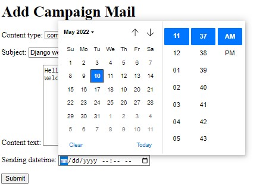

# Mailchamp
Automatic Email Marketing / Newsletter Application. Built using Django and PostgreSQL.

## Description
MailChamp is an Email Marketing / Newsletter service application that kind of immitates what other Cold-Emailing Softwares like MailChimp, Twillio do on a fundamental level.
MailChamp is built with **Django 4.0** and uses **PostgresQL** as a Database.
Mailchimp currently can run on a local machine but soon would be deployed on AWS EC2 (Future Scope)





## Getting Started
### Dependencies
Python >= 3.9

Django >= 4.0

PostgreSQL >= 14.2

APScheduler==3.9.1 (Background Job Scheduler)

Preferred OS- Windows 10/Any linux distribution/Mac

## Setup

The first thing to do is to clone the repository:

```sh
$ git clone https://github.com/tushaverma643/mailchimp.git
$ cd mailchimp
```
Then install the dependencies:

```sh
pip install -r requirements.txt
```
Note that you may use Virtual enviornment as well by using -  `(env)` in front of the prompt. This indicates that this terminal
session operates in a virtual environment.

## Updating settings.py

FInd EMAIL_HOST_USER and  EMAIL_HOST_PASSWORD in mailchamp > settings.py and update the values of those variables respectively.
EMAIL_HOST_USER = 'your gmail address'
EMAIL_HOST_PASSWORD = 'password'

Make sure you have SMTP available in your gmail account by allowing less secure apps to access/send/recieve authentication and sending mail privileges.


Once `pip` has finished downloading the dependencies:
```sh
cd mailchimp
python manage.py runserver --noreload
```
And navigate to `http://127.0.0.1:8000`.
Thats it.

Note: You also need to have postgresQL >=14.0  installed in your computer. To install it follow the following documentaion.

(https://www.postgresqltutorial.com/postgresql-getting-started/install-postgresql/)

## Author
**Tushar Verma**  - Backend Development & Database Integration

Django, PostgresQL

[@tusharverma](https://www.linkedin.com/in/tusharverma643/)

## Version History
* 1.1
    * Initial Release
 

## License

This project is licensed under the MIT License - see the LICENSE.md file for details

